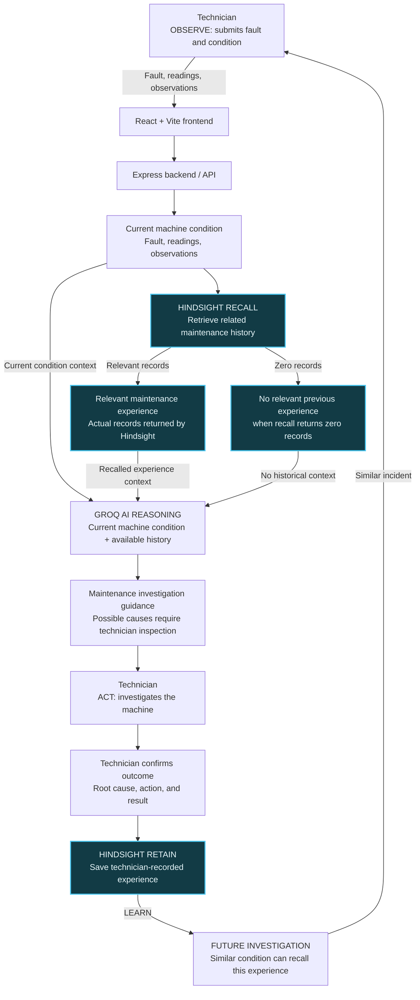

# Smart Factory Maintenance Agent

An AI maintenance investigation agent that combines current machine-condition data with persistent Hindsight experience and Groq-based reasoning. It supports technician-led investigation; it does not diagnose with certainty or operate equipment.

## Problem

Factory maintenance teams may have machine-condition data but lack contextual access to previous maintenance experience. Recurring faults can lead to repeated investigation when prior symptoms, confirmed causes, repairs, and outcomes are difficult to find.

## Solution

The technician submits a fault, symptoms, optional machine readings, and observations. The backend recalls relevant Hindsight memories, then gives the current condition and actual recalled records to Groq. After inspection and repair, the technician can explicitly save the outcome as new Hindsight experience. Investigation requests are never automatically stored as resolved incidents.

## How Hindsight Is Used

1. Technician-recorded maintenance outcomes are stored in a persistent Hindsight bank.
2. A new investigation queries Hindsight using the machine, fault, symptoms, and available readings.
3. Relevant returned experiences are shown in the workspace; retrieval failures are not replaced with invented records.
4. Current condition and recalled experience are passed together to Groq for contextual investigation guidance.
5. A technician records possible cause, confirmed root cause when known, action, result, and notes.
6. The outcome is written synchronously to Hindsight. The UI reports that it was learned only after the write request succeeds.

Possible causes remain unconfirmed unless entered by the technician as a confirmed root cause. Hindsight is used as the persistent memory layer, not browser storage. Browser local storage is used only for the recent-activity list.

## Architecture



**Flow:** OBSERVE → RECALL → REASON → ACT → LEARN. Hindsight retrieves previous experience; Groq reasons over the current condition and any records returned. For Incident 1, zero matches means no prior experience is supplied. After inspection, the technician confirms the outcome and the backend retains it. A similar Incident 2 can recall that saved experience and provide it to Groq. The AI does not confirm the root cause; that remains the technician's responsibility.

- `frontend/`: React interface built and served with Vite.
- `backend/src/routes/`: Express health, investigation, recall, and outcome-retention endpoints.
- `backend/src/services/maintenance-agent.service.js`: Hindsight recall followed by Groq reasoning; does not write outcomes.
- `backend/src/services/hindsight.service.js`: Hindsight client, recall, structured incident formatting, and synchronous retention.
- `backend/src/services/groq.service.js`: Groq chat-completions request and response validation.

## Technology

- React 19 and Vite
- Node.js and Express 5
- Hindsight TypeScript client for persistent memory
- Groq chat completions API
- Browser local storage for recent activity only

## Local Setup

Prerequisites: Node.js and npm.

1. Install backend dependencies and create a local environment file if one does not already exist:

   ```powershell
   cd backend
   npm install
   if (-not (Test-Path .env)) { Copy-Item .env.example .env }
   ```

   Fill the values in `backend/.env`. Keep credentials server-side and do not commit them.

2. Start the backend:

   ```powershell
   cd backend
   npm start
   ```

   The API listens on port `5000` by default. The CORS allowlist defaults to local Vite at `http://localhost:5173`; set `FRONTEND_ORIGIN` to a comma-separated list of exact frontend origins for deployment or a different local origin.

3. In another terminal, install and start the frontend:

   ```powershell
   cd frontend
   npm install
   npm run dev
   ```

   Vite prints the frontend URL. The API base defaults to `http://localhost:5000/api`; set `VITE_API_BASE_URL` to override it.

## Environment Variables

| Variable | Purpose |
| --- | --- |
| `GROQ_API_KEY` | Authenticates backend requests to Groq. |
| `HINDSIGHT_API_KEY` | Authenticates backend requests to Hindsight. |
| `HINDSIGHT_BANK_ID` | Selects the Hindsight memory bank. |
| `HINDSIGHT_BASE_URL` | Hindsight service URL. |
| `PORT` | Optional backend port; defaults to `5000`. |
| `FRONTEND_ORIGIN` | Optional comma-separated CORS origin allowlist; defaults to local Vite origins. |
| `VITE_API_BASE_URL` | Optional frontend API base URL; defaults to `http://localhost:5000/api`. |

## API Endpoints

- `GET /api/health`: confirms the Express backend is responding; it does not probe provider availability.
- `POST /api/maintenance/investigate`: validates current condition, recalls Hindsight memories, and requests Groq guidance. Required fields: `machineId`, `fault`, and `symptoms`. Optional readings: `temperatureC`, `vibrationMmS`, `currentA`, `voltageV`; optional context: `incidentDate`, `technicianObservation`.
- `POST /api/memory/recall`: recalls maintenance memories. Requires `query`; accepts optional `machineId`.
- `POST /api/memory/retain`: explicitly saves a technician-recorded outcome. Requires `machineId`, `fault`, `repairPerformed`, and `repairOutcome`; supports confirmed and possible causes, readings, symptoms, date, and technician observation.

## Demo Flow

1. Start with a machine/fault combination that has no relevant experience in the selected Hindsight bank.
2. Submit the symptoms and optional simulated/manual readings. Confirm that Hindsight returns no relevant experience and Groq provides general investigation guidance.
3. Enter the inspected possible cause, technician-confirmed root cause if known, repair action, result, and notes. Save the experience and wait for the success confirmation.
4. Submit a similar fault for the same machine. The agent queries Hindsight again; when the saved experience is returned, the workspace shows the recalled incident and that Groq received the historical context alongside the new condition.
5. Compare the “without relevant memory” and “with Hindsight memory” panels. Actual recalled records and the latest investigation determine the displayed context; no memory is fabricated for the comparison.

## Demo Evidence

Use the live application and actual provider responses for evidence. Do not create or edit screenshots to imply a different result. The result count below is from the verified live run; future Hindsight recall counts may differ.

### Incident 1: Before Memory

Investigate MTR-101 with simulated/manual readings of 86 °C, 7.1 mm/s vibration, 12.0 A, and 414 V, with the high-vibration/elevated-temperature/current fault. In the verified run, Hindsight returned 0 relevant memories, and Groq generated maintenance investigation guidance from the current condition. The AI did not confirm a root cause.

### Technician Confirms Outcome

The technician recorded bearing wear as the confirmed root cause, bearing replacement as the action, and return to normal operation as the result. The experience was retained only after the technician submitted the outcome and the Hindsight write succeeded.

### Incident 2: After Memory

Investigate the similar MTR-101 condition using 85 °C, 7.0 mm/s, 11.8 A, and 413 V. In the verified live run, Hindsight returned 6 results, including the technician-confirmed bearing wear and repair experience. Groq received the recalled context and produced reasoning that referred to the previous incident. Six is evidence from that run, not a guaranteed result count.

### Screenshot Evidence

| Screenshot | Suggested title | What the judge should notice | Why it proves Hindsight is central |
| --- | --- | --- | --- |
| A | Incident 1: No Relevant Experience | Current condition, simulated/manual label, zero relevant memories, and Groq guidance. | The agent checks persistent memory before reasoning and reports the actual empty recall. |
| B | Technician-Confirmed Outcome Saved | Technician-confirmed root cause, action, result, and the successful “Experience Learned” confirmation. | The new experience enters memory only after technician submission and successful Hindsight retain. |
| C | Incident 2: Hindsight-Informed Investigation | Actual returned memory count and experience records beside the current condition and Groq reasoning. | It shows prior technician experience recalled and used as reasoning context. |

Capture each screenshot from the running application at the corresponding point in the demo. Do not submit a duplicate investigation or retain just to recreate a screenshot; preserve the actual response and confirmation from the original flow.

### Before / After

**Before:** No relevant maintenance experience was returned; Groq reasoned from the current condition.

**After:** A similar condition caused Hindsight to recall the technician-confirmed experience, which Groq received as context. **Illustrative Counterfactual Baseline** remains an illustration, not a separate memory-free AI run.

### Accurate Wording

- Readings are simulated/manual, not real factory sensor deployment.
- The system supports maintenance investigation; it does not guarantee failure prediction.
- Possible causes remain unconfirmed until a technician confirms an outcome.
- The agent does not autonomously confirm root cause or make maintenance decisions.

### Screenshot Checklist

- [ ] Current machine condition visible
- [ ] Simulated/manual label visible
- [ ] Hindsight result count visible
- [ ] Recalled experience visible
- [ ] Groq reasoning visible
- [ ] Technician outcome visible
- [ ] Experience Learned confirmation visible
- [ ] OBSERVE → RECALL → REASON → ACT → LEARN visible
- [ ] No API keys or secrets visible
- [ ] No fake metrics visible

## Important Limitation

The current demo uses simulated/manual machine-condition inputs. It does not connect to factory sensors or provide live industrial monitoring. It is designed for future integration with industrial sensor systems. AI guidance is investigational; a technician must inspect and confirm any cause and follow site safety procedures.

## Security and Deployment

API credentials belong in `backend/.env` or a deployment secret store, never in frontend code. CORS is restricted to configured origins. The root `render.yaml` and `frontend/vercel.json` define the deployment settings; production deployments must configure provider secrets, `FRONTEND_ORIGIN`, and `VITE_API_BASE_URL` for their hosting origins.

### Render Backend

The root `render.yaml` defines the Express API as a Render web service. Create a Render Blueprint from this GitHub repository and enter the prompted secret values in the Render dashboard; do not add them to the YAML or Git. After the service is created, copy its public base URL.

### Vercel Frontend

Import the same GitHub repository into Vercel and set the project Root Directory to `frontend`. The included `frontend/vercel.json` specifies the Vite build and output directory. Configure `VITE_API_BASE_URL` in Vercel as `https://<render-service-host>/api`, then deploy. Copy the deployed frontend origin and set `FRONTEND_ORIGIN` on Render to that exact origin. Redeploy/restart the Render service after changing environment values.

The first Render deployment requires these server-side values: `GROQ_API_KEY`, `HINDSIGHT_API_KEY`, `HINDSIGHT_BANK_ID`, `HINDSIGHT_BASE_URL`, and `FRONTEND_ORIGIN`. They are intentionally not supplied by the repository. Vercel only needs `VITE_API_BASE_URL`; never add provider API keys to Vercel frontend variables.